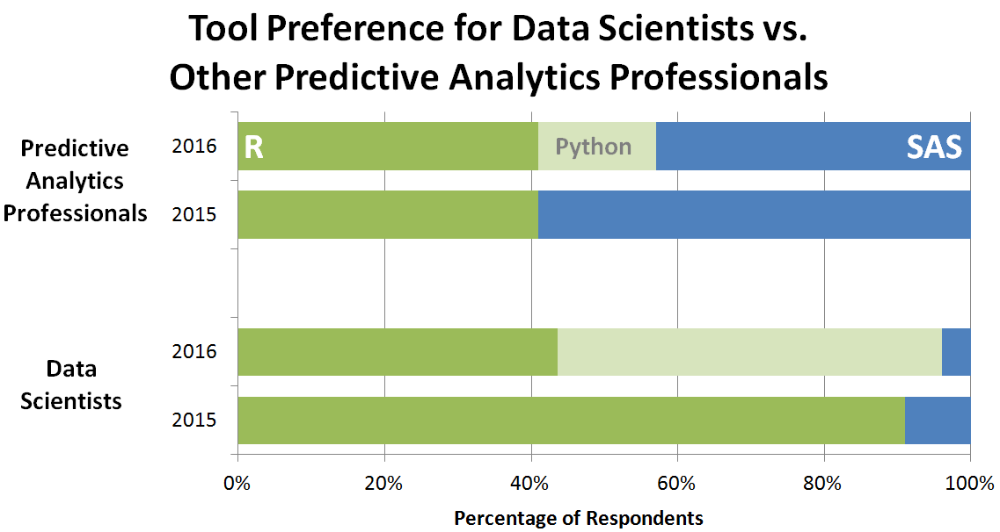
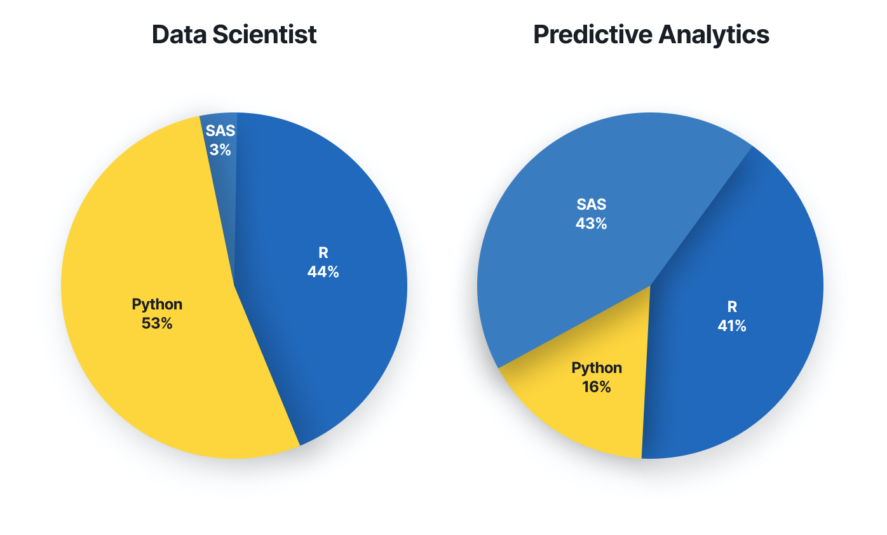
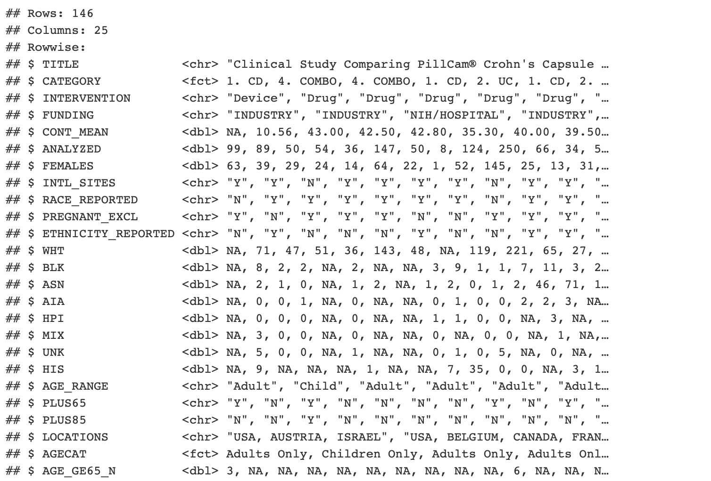
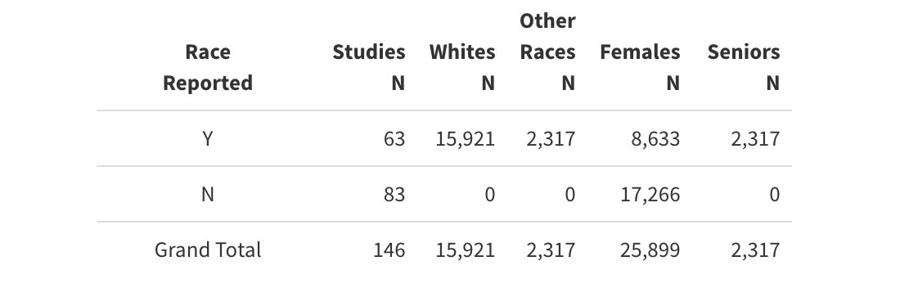
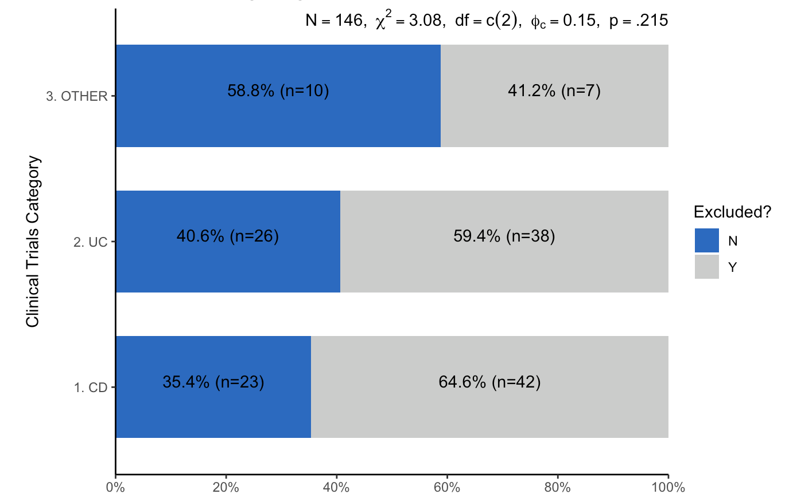
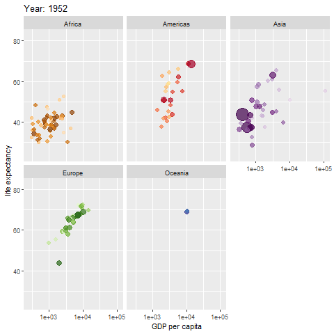

---
# YAML HEADER

title: "IBD Presentation"
subtitle: "Trying to create a customized deck with xaringanthemer"  
author:  "Kevin Williams"
date: '`r Sys.Date()`'
output:
  
  xaringan::moon_reader: 
    css: 
       - "xaringan-themer.css"
#       - "_css/kevin_css.css"
      
    seal: false                     # Prevents Moonreader from Generating a title page
    nature: 
        highlightLines: true        # Code for Highlighting text
        highlightStyle: github      # Highlighting syntax for code
        highlightSpans: true
        ratio: 16:9                     # Slide ratio (4:3 is another common format)
        # self_contained: false
        slideNumberFormat: "%current%"  # Slide number format
        countIncrementalSlides: false  
    
    lib_dir: libs
    
--- 
class: title-slide, bottom, left, inverse, hide-count
<!-- background-image: url(https://i.imgur.com/gA6x2Xb.jpg) -->
background-image: url(IBD-Slideshow_files/figure-html/cells-unsplash.jpeg)
background-size: cover
```{r xaringan-themer, include=FALSE, warning=FALSE}

library(xaringanthemer)

style_duo_accent(
  
  primary_color = "#006cc5",
  secondary_color = "#ccdbee",
    
  # fonts
  header_font_google = google_font("Helvetica Neue"),
  text_font_google = google_font("Helvetica Neue"),
  code_font_google = google_font("Fira Mono"),
  
  # H1-H3 font sizes
  header_h1_font_size= "2.5rem",
  header_h2_font_size = "2.0rem",
  header_h3_font_size = "1.85rem",
  base_font_size =      "1.15rem",
  
  code_font_size=       "0.55rem",
  code_inline_background_color =  "0.55rem",
  code_highlight_color = "rgb(0, 108, 197, 0.2)",

  
  #colors
  inverse_header_color=           "#FFFFFF",
  inverse_link_color=             "#ef8de4",
  title_slide_text_color=         "#FFFFFF",
  title_slide_background_color=   "#006cc5",
  header_background_color=        "#006cc5",
  header_background_text_color=   "#006cc5",
  header_color=                   "#006cc5",
  link_color =                    "#ef8de4",
  black = "#000000",
  white = "#FFFFFF"
  
)
  
  
```


```{r setup, include=FALSE}
options(htmltools.dir.version = FALSE)

knitr::opts_chunk$set(
  fig.width=9, fig.height=3.5, 
  fig.retina=3, 
  dpi=300,
  out.width = "100%",
  cache = FALSE,
  echo = TRUE,
  message = FALSE, 
  warning = FALSE,
  hiline = TRUE
  
)
```

```{css echo=FALSE}


.hide-count .remark-slide-number {
  display: none;
}

.hide-count-title  .title-slide-number {
  display: none;
}

.table-hover > tbody > tr:hover { 
  background-color: "#ccdbee";
}

.element {
  scroll-snap-align: start;
}

table.center {
  margin-left: auto; 
  margin-right: auto;
}


```

```{r xaringanExtra, echo=FALSE}
xaringanExtra::use_xaringan_extra(c("tile_view", "animate_css", "panelset", "tile"))

# xaringanExtra::use_xaringan_extra(c("tile_view", "animate_css", "panelset", "tile", "scribble"))
```


# Investigating IBD Clinical Trial Disparities
### (Rabinowitz, Silver et al.)
### <br>
### USING THE R PROGRAMMING LANGUAGE
#### Prepared by Kevin Williams  | Preliminary Findings   |   September 14, 2021
#### <br>
#### <br>

---
layout: true
<!-- background-image: url(https://i.imgur.com/5rlX8bi.png) -->
background-image: url(IBD-Slideshow_files/figure-html/havard-bil.png)
background-position: 3% 98.5%
background-size: 110px 65px

---
## So why Redo this in R?


<center></center>

---
## So why Redo this in R?

- Excellent <font color="#006cc5">**learning opportunity**</font color>

--

- Provides another chance to <font color="#006cc5">**validate SAS results**</font color> prior to publication

--

- R provides a wider variety of add-on packages that can enhance preliminary output - <font color="#006cc5">**makes sharing with collaborators fun**</font color>

--

- Data scientists have made a marked <font color="#006cc5">**shift to R and Python**</font color> and away from SAS and SPSS

<br>


<!--  -->

<center></center>

---
class: hide-count, inverse
background-image: url(IBD-Slideshow_files/figure-html/keyboard-unsplash.jpeg)
background-size: cover


## Task No. 1
### Import and cleanse IBD data file downloaded by Authors from the [ClinicalTrials.gov](https://clinicaltrials.gov/ct2/results?cond=IBD&cntry=US&Search=Apply&recrs=e&age_v=&gndr=&type=&rslt=With) website.


---
## Data Clean-Up

.panelset[
.panel[.panel-name[Import Data]

```{r Data-Cleanup-Import, eval=F}

require(readxl)
require(readr)  # use if importing a comma- or tab-delimited dataset #
require(haven)  # if importing a SAS dataset #

IBD <- read_excel("../IBD Clinical Trials Paper/IBD Disparities 5-30.xlsx") #<<


# make.names function essentially replaces all spaces and non-standard characters
# (parens, brackets, etc.) with a series of periods


names(IBD)<-  make.names( names(IBD), unique = TRUE ) #<<
```

]

.panel[.panel-name[Cleanse Data]

Here's area few codes nippets from the  <font color="#006cc5">**dplyr**</font color> and <font color="#006cc5">**broom**</font color> packages that we used to wrangle our data:
```{r Data-Cleanup-Cleanse, eval=F}
require(dplyr)
require(broom)  
require(tidyverse)  

# loading tidyverse package would actually install dplyr and other dependent packages #


```


```{r Data-Cleanup-Cleanse1, echo=F}

# Create smaller data table that has only the variables of interest

IBD2 <-
  
    IBD %>%
  
  
  select( "Title", "Category..CD..UC..IBD.", "Interventions", 
          "Funded.By", "Age.Continuous..Mean.", 
          "Analyzed", "Female.N", "Included.International.Sites..Y.N.",
          "Race.Reported..Y.N...Race..American.Indian.or.Alaska.Native..Asian..Black.or.African.American..Native.Hawaiian.or.Other.Pacific.Islander..and.White..",
          'Were.pregnant.breastfeeding.women.excluded.from.trial.',
          "Ethnicity.Reported..Y.N...Ethnicity..Hispanic.or.Latino..and..Not.Hispanic.or.Latino....", 
          "White.N", "Black.or.African.American.N", "Asian.N",
          "American.Indian.Alaska.Native.N", "Native.Hawaiian.Pacific.Islander.N", 
          "More.than.One.Race.Reported.N", "Unknown.Not.Reported.N","Hispanic.N",
          "Age..0.18.child..18...Adult.", 
          "Included...65.years..Y.N.", 
          "Included....85..Y.N.", 
          "X.65.N",
          "LOCATIONS2") %>%

      dplyr::rename( CATEGORY = "Category..CD..UC..IBD.", 
              Funding = "Funded.By", Intervention= "Interventions", 
              CONT_MEAN = "Age.Continuous..Mean.", 
              FEMALES = "Female.N" , 
              AGE_RANGE = "Age..0.18.child..18...Adult.", 
              PLUS65= "Included...65.years..Y.N.", 
              PLUS85= "Included....85..Y.N.",
              INTL_SITES = "Included.International.Sites..Y.N.", 
              PREGNANT_EXCL = 'Were.pregnant.breastfeeding.women.excluded.from.trial.',
              RACE_REPORTED = "Race.Reported..Y.N...Race..American.Indian.or.Alaska.Native..Asian..Black.or.African.American..Native.Hawaiian.or.Other.Pacific.Islander..and.White..",
              ETHNICITY_REPORTED = "Ethnicity.Reported..Y.N...Ethnicity..Hispanic.or.Latino..and..Not.Hispanic.or.Latino....",
              WHT = "White.N", 
              BLK = "Black.or.African.American.N",
              ASN = "Asian.N", AIA = "American.Indian.Alaska.Native.N", 
              HPI = "Native.Hawaiian.Pacific.Islander.N", 
              MIX= "More.than.One.Race.Reported.N",
              UNK = "Unknown.Not.Reported.N", 
              HIS= "Hispanic.N",
              LOCATIONS  = "LOCATIONS2")  %>%
  
      rename_all(toupper) %>%
  
      mutate(CATEGORY = str_replace(str_replace_all(CATEGORY, "IBDU", "IBD"), "IBD", "IBDU"))   %>%
      mutate(RACE_REPORTED = ifelse( (RACE_REPORTED == "not reported" | RACE_REPORTED == "N"), "N", "Y"))  %>%
  
      rowwise() %>%
  
      mutate(CATEGORY = paste(sort(unlist(strsplit( CATEGORY, ", ", fixed = TRUE))), collapse = ", ") ) %>%
      mutate( INTERVENTION =   str_replace(str_trim(str_sub( INTERVENTION, 1, str_locate( INTERVENTION, ":")[1] ),"both"),":","") ) %>%
  
      mutate( FUNDING =  case_when (  str_trim(word(FUNDING, 1, sep=("-")), "both") == "Industry"  ~ "INDUSTRY",
                                        str_trim(word(FUNDING, 1, sep=("-")), "both") == "Other" ~ 
                                        
                                        case_when( str_locate(FUNDING, "Industry")[1] >0 ~ "INDUSTRY",
                                                   str_locate(FUNDING, "Hospital")[1] >0 | str_locate(FUNDING, "Clinic")[1] >0  |
                                                   str_locate(FUNDING, "Health Care")[1] >0 | str_locate(FUNDING, "Medical Center")[1] >0 | str_locate(FUNDING, "Health")[1] >0 |
                                                   str_locate(FUNDING, "NIH")[1] >0 ~ "NIH/HOSPITAL",
                                                   str_locate(FUNDING, "College")[1] >0 |  str_locate(FUNDING, "University")[1] >0 | str_locate(FUNDING, "NIH")[1] >0 ~ "NIH/UNIVERSITY",
                                                   str_locate(FUNDING, "NIH")[1] >0 ~ "NIH/HOSPITAL",
                                                   TRUE ~ "ZZZ"), TRUE ~ "NIH/HOSPITAL")) %>%
  
      mutate (AGECAT =   case_when (str_locate( AGE_RANGE, ",")[1] >0 ~ 3,
                                    str_locate( AGE_RANGE, "Adult")[1] >0 ~ 2,
                                    str_locate( AGE_RANGE, "Child")[1] >0 ~ 1,
                                    TRUE ~ 99 )) %>%
  
      mutate (AGECAT = recode_factor ( AGECAT,
                                       "1" = "Children Only",
                                       "2" = "Adults Only",
                                       "3" = "Children & Adults"))  %>%
  
       mutate (CATEGORY = recode_factor ( CATEGORY,
                                   "CD" = "1. CD",
                                   "UC" = "2. UC",
                                   "IBDU" = "3. IBDU",
                                   .default = "4. COMBO"))  %>%
  

      mutate( PLUS65 = ifelse( PLUS65=="N/A", "N", PLUS65)) %>%
      mutate( PLUS85 = ifelse( PLUS85=="N/A", "N", PLUS85)) %>%
      mutate(AGE_GE65_N = ifelse( X.65.N >= 0, X.65.N, 0)) %>%
      select ( -X.65.N)

  # reorder the factor levels of categorical variable "CATEGORY"

  IBD2$CATEGORY <- factor( IBD2$CATEGORY, levels= c("1. CD", '2. UC', '3. IBDU', '4. COMBO')) 
  IBD2 <- as.data.frame(IBD2)

```


```{r Data-Cleanup-Cleanse2, eval=F}

# Create smaller data table that has only the variables of interest

IBD2 <-  # the <- operator assigns what follows to the new dataset name on the opposite side
  
  IBD %>%
     select(  # select variables of interest from IBD file ) %>%  #<<
     rename(  # rename theses variables to suit your working style)  %>%  #<<
     mutate(  # [1] mutate existing variables to change their content or structure, or  #<<
              # [2] create brand new variables based on existing variables ))    #<<

```


<center>Note the use of the pipe <font color="#006cc5">( %>% )</font color>  operator</center> #<<

]
.panel[.panel-name[Final Data Frame]
```{r  Data-Cleanup-Glimpse, eval=F }
glimpse (IBD2)
```

<center></center>
]

.panel[.panel-name[Sample Summary Stats]

```{r  Data-Cleanup-SampSum, eval=F}
require(kableExtra)

 IBD2 %>% 
    select( RACE_REPORTED, WHT:UNK, FEMALES, AGE_GE65_N) %>% 
    mutate_each( funs(replace(., which(is.na(.)), 0))) %>%
    mutate( OTHER = sum(BLK,ASN,AIA,HPI,MIX,UNK) ) %>% 
    select( RACE_REPORTED, WHT, OTHER, FEMALES, AGE_GE65_N) %>% 
    group_by( RACE_REPORTED) %>% 
    summarise( n = n(), WHT = sum(WHT), OTHER = sum(OTHER), FEMALES = sum(FEMALES), 
               SENIORS = sum(AGE_GE65_N) )  %>% 
    arrange( desc(RACE_REPORTED) ) %>% 
    rbind( summarise_all(., ~if(is.numeric(.)) sum(.) else "Grand Total"))  %>%    
   
   . . .  other statements fed to KableExtra table rendering package #<<
```

<!-- # ```{r echo=F, fig.align="right", out.width="100px", fig.show='asis'} -->
<!-- # knitr::include_graphics("_images/skinny-arrow.png") -->
<!-- # ``` -->

<center></center>
<!-- <center></center> -->
<!--  -->
]

]

---
class: hide-count, inverse
background-image: url(IBD-Slideshow_files/figure-html/codeblue-unsplash.jpeg)
background-size: cover


## Task No. 2
### Produce a series of <font color="#ef8de4">descriptive summary tables</font color> as part of exploratory analysis.

---
## Select Summary Tables

.panelset[
.panel[.panel-name[Trial Interventions]
.pull-left[
#### <font color="#006cc5">IBD Trials by Type of Intervention being Investigated</font color\>
```{r Trial-Interv, eval=F}
 IBD2 %>%
   mutate(INTERVENTION = toupper(INTERVENTION) ) %>% 
   group_by( INTERVENTION ) %>% 
   summarise( FREQUENCY = n() ) %>% 
   mutate (PCT = percent(FREQUENCY / sum(FREQUENCY)) ) %>% 
   arrange ( INTERVENTION )  %>% 
  
   . . .  other statements fed to KableExtra  #<<
          table rendering package  #<<
```


```{r plot-interv, echo=F, eval=F}
IBD2 %>% 
   mutate(INTERVENTION = toupper(INTERVENTION) ) %>% 
   group_by( INTERVENTION ) %>% 
   summarise( FREQUENCY = n() ) %>% 
   mutate (PCT = round(FREQUENCY / sum(FREQUENCY),3) ) %>%
   mutate (PCT = percent( substr(PCT,1,5)) ) %>% 
   filter(PCT > 0.01)  %>% arrange( INTERVENTION )  %>% 
   
   kbl(booktabs = T, format= "html", linesep='', padding=0,  #<<
       align= c('l','r','r','r','r'), escape=F,  #<<
       col.names= linebreak(c("Type of Intervention", #<<
                              "Frequency","Percent"))) %>%  #<<
   kable_paper(html_font= "Helvetica Neue", full_width = F, "hover", #<<
                  font_size=16) %>% #<<
                  column_spec(1, width = "7cm") #<<
```
]
.pull-right[
<br>
```{r plot-interv-out, ref.label= 'plot-interv', echo=F}
```
]
]

.panel[.panel-name[Funding Sources]
.pull-left[
#### <font color="#006cc5">IBD Trials by Funding Source</font color\>
```{r Funding-Source, eval=F}
 IBD2 %>% 
   group_by( FUNDING ) %>% 
   summarise( FREQUENCY = n() ) %>% 
   mutate (PCT = percent( FREQUENCY / sum(FREQUENCY)) ) %>%
    arrange ( FUNDING )  %>% 
  
   . . .  other statements fed to KableExtra  #<<
          table rendering package  #<<
```


```{r plot-funding, echo=F, eval=F}
 IBD2 %>% 
   group_by( FUNDING ) %>% 
   summarise( FREQUENCY = n() ) %>% 
   mutate (PCT = round(FREQUENCY / sum(FREQUENCY),3) ) %>%
   mutate (PCT = percent( substr( PCT, 1,5)) ) %>% 
    arrange ( FUNDING )  %>% 
 
    kbl(booktabs = T, format= "html", #<<
        align= c('l','r','r','r','r'), escape=F, #<<
        col.names= linebreak(c("Funding Source", #<<
                     "Frequency", "Percent"))) %>%  #<<
       kable_paper(html_font= "Helvetica Neue", full_width = F, "hover",
                      font_size=16) %>%  #<<
                      column_spec(1, width = "6cm") 

```

]
.pull-right[
<br>
<br>
```{r plot-funding-out, ref.label= 'plot-funding', echo=F}
```
]
]

.panel[.panel-name[Female Representation]
.pull-left[
#### <font color="#006cc5">Female Representation in IBD Trials</font color\>
```{r Female-Rep, eval=F}
IBD2  %>%
  select( CATEGORY, ANALYZED, FEMALES) %>%
    group_by( CATEGORY )  %>%
    summarise( Trials_N = n(), Total_Subjects_N = sum(ANALYZED), Female_N = sum(FEMALES) , 
               Pct_Female = Female_N / Total_Subjects_N ) %>%
    arrange( as.character(CATEGORY) ) %>%
    rbind(summarise_all(., ~if(is.numeric(.)) sum(.) else "Grand Total"))  %>%
    mutate( Pct_Female = case_when ( CATEGORY == "Grand Total" ~ Female_N / Total_Subjects_N,
                                     TRUE ~ Pct_Female )) %>%
    mutate( Total_Subjects_N = prettyNum(Total_Subjects_N, big.mark=","),
            Female_N = prettyNum( Female_N, big.mark=","),
            Pct_Female = percent( Pct_Female ) )   %>% 
  
   . . .  other statements fed to KableExtra  #<<
          table rendering package  #<<
```


```{r plot-females, echo=F, eval=F}
  IBD2  %>%
    select( CATEGORY, ANALYZED, FEMALES) %>%
      group_by( CATEGORY )  %>%
      summarise( Trials_N = n(), Total_Subjects_N = sum(ANALYZED), Female_N = sum(FEMALES) , 
                   Pct_Female = round((Female_N / Total_Subjects_N),3) )      %>%
      arrange( as.character(CATEGORY) ) %>%
      rbind(summarise_all(., ~if(is.numeric(.)) sum(.) else "Grand Total"))  %>%
      mutate( Pct_Female = case_when ( CATEGORY == "Grand Total" ~ Female_N / Total_Subjects_N, TRUE ~ Pct_Female )) %>%
      mutate( Total_Subjects_N = prettyNum(Total_Subjects_N, big.mark=","),
                  Female_N = prettyNum( Female_N, big.mark=","),
                  Pct_Female = percent( substr(Pct_Female,1,5) ) )   %>% 

      kbl( booktabs = T, format= "html",
           align= c('l','r','r','r','r'), escape=F, 
         col.names = linebreak(c("Category", 
                                 "Trials<br>N", 
                                 "Total<br>Subjects<br>N", 
                                 "Female<br>N", 
                                 "Pct<br>Female"))) %>% 
         kable_paper( html_font= "Helvetica Neue",
                        full_width = F, "hover",  font_size=16) %>% 
                        column_spec(1, width = "6cm") %>% 
                        row_spec( 5, bold=T )
```


]
.pull-right[
<br>
```{r plot-females-out, ref.label = 'plot-females', echo=F}
```
]
]


.panel[.panel-name[Pregnancy Exclusion]
.pull-left[
#### <font color="#006cc5">IBD Trials Excluding Pregnant Subjects</font color\>
```{r Pregnancy-Excl, eval=F}
require(sjPlot)  #<<

IBD2$CAT2 <-  factor(as.character(IBD2$CATEGORY))
levels(IBD2$CAT2) <- c("1. CD", "2. UC", 
                       "3. OTHER", "3. OTHER")
             
plot_xtab(IBD2$CAT2, IBD2$PREGNANT_EXCL, margin = "row", 
          bar.pos = "stack", coord.flip = TRUE, 
          axis.titles = c('Clinical Trials Category'), 
          legend.title= "Excluded?",
          geom.colors = c("#006cc5","#cbcccb"), 
          show.summary = TRUE )+ 
          set_theme(base= theme_classic()) 

```
]
.pull-right[
<center></center>  ]
<!-- <center></center>  ] -->

]

]


---
## Select Summary Tables, cont.

.panelset[


.panel[.panel-name[International Sites]
.pull-left[
#### <font color="#006cc5">IBD Trials Recruiting Internationally</font color\>
```{r International-Sites, eval=F}
 IBD2 %>% 
   group_by( INTL_SITES ) %>% 
   summarise( Frequency = n() ) %>% 
   mutate (Pct = percent( Frequency / sum(Frequency)) ) %>%
   arrange ( desc(INTL_SITES)  )  %>%
  
   . . .  other statements fed to KableExtra  #<<
          table rendering package  #<<
```


```{r plot-intl, echo=F, eval=F}
 IBD2 %>% 
   group_by( INTL_SITES ) %>% 
   summarise( Frequency = n() ) %>% 
   mutate (Pct = round( Frequency / sum(Frequency),3) ) %>%
   mutate (Pct = percent(substr(Pct,1,5)) )  %>% 
   arrange ( desc(INTL_SITES)  )  %>%
  
   kbl( booktabs = T, format= "html",
          align= c('c','c','r'), escape=F, 
         col.names = linebreak(c("International<br>Sites?", 
                                 "Frequency", 
                                 "Percent"))) %>% 
         kable_paper( html_font= "Helvetica Neue",
                        full_width = F, "hover",  font_size=16) %>% 
                        column_spec(1, width = "5cm") %>% 
                        column_spec(2:3, width= "2.5cm")
```

]

.pull-right[<br>
```{r plot-intl-out, ref.label = 'plot-intl', echo=F}
```
]
]


```{r LOCATIONS, echo=F}

# Create new data frame with just the LOCATIONS variable
LOCATIONS <-   as.data.frame(IBD2) %>% select(LOCATIONS) %>% tbl_df


# Create a second data frame that will be used the store the pivoted data
SITES <- data.frame( ID= character(0), COUNTRY=character(0), STUDIES= numeric(0)  )


# for loop in action that takes every value in COUNTRY delimited by a comma and sets that value in its own row:

for (j in 1: nrow(LOCATIONS) ){
  
    y <- 0
    loccount<- str_count( LOCATIONS$LOCATIONS[j], ",")+1 
    
    temp  <- data.frame(  ID= character(0), COUNTRY=character(0), STUDIES= numeric(0) )
    
    # print( paste("j", j, sep="="))
    # print( paste("countries", loccount, sep="="))
  
  
  for (i in 1:loccount ){

  a <- str_trim(word( LOCATIONS$LOCATIONS[j], i, sep=(",")))
  y <- 1
  
  temp[i, 1:2] = c( paste("TRIAL", j, sep=" "), a )
  temp[i, 3]   = y

  }   
    
  SITES = rbind(SITES, temp) 
  
  if (j==nrow(LOCATIONS)){ rm( a, i, j, loccount, y, temp ) }
  
}


```


.panel[.panel-name[Site List & Percentiles]
```{r Percentiles, echo=F}
require(kableExtra)

 
  SITES2 <-
    SITES %>% group_by( COUNTRY ) %>% 
    summarise( COUNT = n()) %>% 
    arrange( desc(COUNT) ) %>% 
    mutate( PERCENT =  round( (COUNT / sum(COUNT)), 3)  ) %>% 
    mutate( PERCENT = percent( substr(PERCENT,1,5)) ) %>% 
    mutate( PERCENTILE = round( rank( COUNT )/length( COUNT )*100,1) ) %>% 
    mutate (QUARTILE = ntile( (COUNT ), 4)) %>% 
    arrange ( desc(QUARTILE, COUNT) ) %>% tbl_df
  
  kbl(SITES2, booktabs = T, format= "html", 
      caption = "<br><center><strong>Countries Recruiting Subjects for US-based IBD Clinical Trials</strong></center><br>",
      align= c('l','r','r','r','c'), escape=F, 
      col.names = linebreak(c("Country", "Trials<br>N", "Percent", "Percentile", "Quartile"))) %>% 
    
      kable_paper(full_width = F, html_font= "Helvetica Neue", "hover", font_size=18) %>% column_spec(1, width = "10cm") %>% column_spec(2:5, "3cm") %>% 
      scroll_box(height = "4.25in", width= "23cm" )

```

]
]

---

## <font color="#006cc5">Site Map</font color\>
#### <center>Countries (56) with Recruitment Sites for US-based IBD Clinical Trials</center>

```{r World-Plot, echo=F}

require(sf)
require(rnaturalearth)
require(ggplot2)

rm(WORLDMAP)

#import a global map from the sf package


WORLDMAP <- ne_countries(scale = "medium", returnclass = "sf")

WORLDMAP <- 
    WORLDMAP %>% 
    filter( admin != "Antarctica") %>%
    mutate (name_sort = toupper( name_sort) )


#append our IBD survey count based on the ISO3 value

WORLD_ISO_CODES <- read_excel("world postal codes.xlsx", sheet = "world postal codes")

WORLD_ISO_CODES <- 
    WORLD_ISO_CODES %>% 
       mutate( ISO3C = str_pad( ISO3N, 3, pad="0") )


#update SITES with ISO codes, but you have to remove the format from the PERCENT variable first -- SQL doesn't allow "formattable" text

#reconvert PERCENT back to a numeric, unstylized variable

SITES2$PERCENT <- as.numeric(SITES2$PERCENT)


SITES3 <-  sqldf(  "select a.*,
                    case a.COUNTRY when 'USA' then 'USA'
                                   when 'RUSSIA' then 'RUS'
                                   when 'UK' then 'GBR'
                                   when 'KOREA' then 'KOR'
                                   when 'BOSNIA-HERZEGOVINA' then 'BIH' else b.ISO3 end as ISO3,
                                   
                                   
                    case a.COUNTRY when 'USA' then '840'
                                   when 'RUSSIA' then '643'
                                   when 'UK' then '826'
                                   when 'KOREA' then '410'
                                   when 'BOSNIA-HERZEGOVINA' then '070' else b.ISO3C end as ISO3C
             from SITES2 as a left join
                  WORLD_ISO_CODES as b on (a.COUNTRY = b. CAPNAME)"  )


# replace the desired format

SITES2$PERCENT <- percent(SITES2$PERCENT)


################################################################


#append the COUNT and PERCENTILE from the SITES data frame as variables to the  WORLDMAP sf file  

#str(SITES)


WORLDMAP <- left_join( WORLDMAP, SITES3[, -6], 
                              by = c("iso_n3" = "ISO3C"))

WORLDMAP <-
    WORLDMAP %>% 
    mutate( QRTL = as.factor(QUARTILE) )


cols <- c("1" = "#d7fcd2", "2" = "#7ecdbb", "3" = "#368fc0", "4" = "#045a8d")

ggplot(data = WORLDMAP, aes( fill= QRTL)) +
  
  geom_sf(lwd = 0.1 ) +
  
  scale_color_manual("Quantiles",
                     values = cols,
                     aesthetics = c("color", "fill"),
                     na.value = "#d2dee0") +
  
  theme_bw()+
  xlab("Longitude") + ylab("Latitude") +
  # ggtitle("Countries with Sites for US-based IBD Trials", subtitle = paste0("(", length(unique(SITES$COUNTRY)), " participating countries)")) +
  #  theme(plot.title =   element_text(color = "black", size = 14, face = "bold", hjust= 0))+
  # theme(plot.subtitle= element_text(color = "black", size = 12,  hjust= 0))+
  theme(    panel.background = element_rect(fill = NA, color=NA), 
            plot.background = element_rect(fill = "transparent", color = NA), 
            legend.background = element_rect(fill = "transparent", color= NA), 
            legend.box.background = element_rect(fill = "transparent", color= NA)  )+
             
  theme(legend.position= "right")  +
  
 # annotation_scale(location = "br", width_hint = 0.15, plot_unit = "km" ) +
  annotation_north_arrow(location = "bl", which_north = "true", 
                         pad_x = unit(0.05, "in"), pad_y = unit(0.05, "in"), height= unit(0.5, "in"),
                         style = north_arrow_fancy_orienteering ) + 
  coord_sf( expand= F)

```


---
class: inverse, hide-count
background-image: url(IBD-Slideshow_files/figure-html/codeblue-unsplash.jpeg)
background-size: cover


## Task No. 3
### Report the <font color="#ef8de4">race/ethnicity demographics</font color> obtained from those IBD trials where such information was collected.

---
## Did Most Studies Collect Race Data?

```{r Race-Collection, echo=F}
require(treemap)

IBD2 %>% 
    select( RACE_REPORTED, WHT:MIX) %>% 
    group_by( RACE_REPORTED) %>% 
    summarize ( TRIALS =  n() ,
                WHT =     sum(WHT, na.rm=T), 
                BLK =     sum(BLK, na.rm=T),
                ASN =     sum(ASN, na.rm=T), 
                AIA =     sum(AIA, na.rm=T), 
                HPI =     sum(HPI, na.rm=T), 
                MIX =     sum(MIX, na.rm=T)  ) %>% 
  
    pivot_longer( cols= c(WHT,BLK,ASN,AIA,HPI,MIX),
                        names_to = "RACE",
                        values_to = "COUNT" ) %>% 
    mutate( RACE = ifelse( RACE_REPORTED == "N", "NONE", RACE ))  %>% 
    mutate( RACE_REPORTED = as.factor(RACE_REPORTED) ) %>% 
    filter( RACE_REPORTED == "Y" | (RACE_REPORTED == "N" & row_number(RACE_REPORTED)==1) ) %>% 
  
    mutate( PCT = COUNT / sum(COUNT) )  %>% 
    mutate( WCT =  ifelse( RACE_REPORTED == "N", TRIALS, TRIALS*PCT ))   %>% 
    mutate( CONDLABEL = ifelse( RACE_REPORTED== "Y", paste0(RACE, "\n", percent(PCT,1)), NA)) %>% 
    mutate( RACE2 = ifelse ( RACE %in% c("AIA","HPI","MIX"), "OTH", RACE))   %>% 
    mutate( CONDLABEL2 = ifelse( RACE_REPORTED == "Y", paste("Race Reported","\n","N =",TRIALS,"\n"),
                                                       paste("Race Not Reported","\n","N =",TRIALS,"\n"))) %>% 

 
treemap(
      index= c("CONDLABEL2", "RACE"),
      vSize= "WCT",
      type = "index",
      fontsize.labels = c(15,10),
      fontcolor.labels = c("white", "black"),
      bg.labels= "transparent",
      align.labels= list(c("left", "top"), c("center", "center")),
      title= "",
      border.col= c("black", "white"),
      border.lwds = c(3, 1),
      palette = "Set3"

)

```

<center> Only 43% of studies (n=63) collected race data - and even then, not all races necessarily participated in trials.  It is also unclear from available data whether there was consistency among trials in terms how "race" was defined.</center>


---
## <font color="#006cc5">How Was Race/Ethnicity Reported?</font color>
.pull-left[
```{r Race-Report-WHT, echo=F}
library(gt)

raceshort <-  c("White","Black","Asian","AIA", "HPI", "Mixed","Unknown","Hispanic")
racelong  <-  c("WHITE","BLACK","ASIAN","AMER INDIAN/ALASKAN NATIVE", "HAWAIIAN/PACIFIC ISLANDER","MIXED RACE","UNKNOWN","HISPANIC ETHNICITY")


 gt( MASTER[ MASTER$RACE== "WHT" , ] ) %>% 

tab_header(
     title = md("**Race = WHITE**"),
)  %>%
     
     cols_hide(
          columns = c("RACE", "RACE_REPORTED")
     ) %>% 
     
     #sets the font for the entire table      
     opt_table_font(
          font = c(
               "Guide",
               default_fonts()
          )
     ) %>%
     
     cols_label(
          CATEGORY =          md("**Category**"),
          TRIALS_N =          md("**Trials<bR>N**"),
          TOTAL_SUBJECTS_N =  md("**Total<br>Subjects**"),
          RACE_N =            md("**Whites**") ,
          NONRACE_N =         md("**Non-Whites**"),
          PCT_RACE =          md("**%<br>White**")
     ) %>% 
     
     tab_options(
          heading.title.font.weight = "bold",
          heading.title.font.size = "12pt",
          heading.subtitle.font.size = "12pt",
          footnotes.padding = "8pt",
          footnotes.border.bottom.style = NULL,
          heading.padding = "8pt",
          column_labels.font.weight = "bold",
          stub.background.color="#E6EFFC"
     ) %>% 
     #font for Column Labels - redundant
     tab_style(
          style = cell_text(font = "Helvetica Neue"),
          locations= cells_column_labels( columns= everything())
     ) %>%
     
     #cell formats (does not affect Header & Caption)  >
     tab_style(
          style = cell_text( font =  "Helvetica Neue"),
          locations = cells_body(columns = c(1:7) )
     )  %>%
     
     #cell font size
     tab_options(
          table.font.size = "10pt"
     ) %>% 
     
     #number formats    
     fmt_number( columns= c(3:6), decimals=0, sep_mark=",")  %>% 
     fmt_percent( columns= 7, decimals=1 )  %>% 
     
     tab_style(
          style = cell_text(align = "right"),
          locations = cells_column_labels(columns = c(3:7))
     ) %>%
     #cell alignment
     tab_style(
          style = cell_text(align = "right"),
          locations = cells_body(columns = c(3:7))
     ) %>%
     #italicizing Subtotal rows    
     tab_style(
          style = cell_text(style = "italic"),
          locations = cells_body( rows = c(5, 10) )
     )%>%
     
     
     # #bold Grand Total
     # tab_style(
     #      style = cell_text(weight = "bold"),
     #      locations = cells_body( rows = c(11) )
     # ) %>%
     
     
     tab_style(
          style = cell_text(weight = "bold"),
          locations = cells_body( columns =1 )
     ) %>%
     #adjust columnn widths
     cols_width(
          starts_with("CATEGORY") ~ px(100),
          everything() ~ px(70)
     )  %>%
     #handle missing data NA = em dash
     fmt_missing(
          columns = c(4:7),
          missing_text = "---",
     )   


```
].pull-right[
```{r Race-Report-ASN, echo=F}
library(gt)

raceshort <-  c("White","Black","Asian","AIA", "HPI", "Mixed","Unknown","Hispanic")
racelong  <-  c("WHITE","BLACK","ASIAN","AMER INDIAN/ALASKAN NATIVE", "HAWAIIAN/PACIFIC ISLANDER","MIXED RACE","UNKNOWN","HISPANIC ETHNICITY")


 gt( MASTER[ MASTER$RACE== "ASN" , ] ) %>% 

tab_header(
     title = md("**Race = ASIAN**"),
)  %>%
     
     cols_hide(
          columns = c("RACE", "RACE_REPORTED")
     ) %>% 
     
     #sets the font for the entire table      
     opt_table_font(
          font = c(
               "Guide",
               default_fonts()
          )
     ) %>%
     
     cols_label(
          CATEGORY =          md("**Category**"),
          TRIALS_N =          md("**Trials<bR>N**"),
          TOTAL_SUBJECTS_N =  md("**Total<br>Subjects**"),
          RACE_N =            md("**Asians**") ,
          NONRACE_N =         md("**Non-Asians**"),
          PCT_RACE =          md("**%<br>Asian**")
     ) %>% 
     
     tab_options(
          heading.title.font.weight = "bold",
          heading.title.font.size = "12pt",
          heading.subtitle.font.size = "12pt",
          footnotes.padding = "8pt",
          footnotes.border.bottom.style = NULL,
          heading.padding = "8pt",
          column_labels.font.weight = "bold",
          stub.background.color="#E6EFFC"
     ) %>% 
     #font for Column Labels - redundant
     tab_style(
          style = cell_text(font = "Helvetica Neue"),
          locations= cells_column_labels( columns= everything())
     ) %>%
     
     #cell formats (does not affect Header & Caption)  >
     tab_style(
          style = cell_text( font =  "Helvetica Neue"),
          locations = cells_body(columns = c(1:7) )
     )  %>%
     
     #cell font size
     tab_options(
          table.font.size = "10pt"
     ) %>% 
     
     #number formats    
     fmt_number( columns= c(3:6), decimals=0, sep_mark=",")  %>% 
     fmt_percent( columns= 7, decimals=1 )  %>% 
     
     tab_style(
          style = cell_text(align = "right"),
          locations = cells_column_labels(columns = c(3:7))
     ) %>%
     #cell alignment
     tab_style(
          style = cell_text(align = "right"),
          locations = cells_body(columns = c(3:7))
     ) %>%
     #italicizing Subtotal rows    
     tab_style(
          style = cell_text(style = "italic"),
          locations = cells_body( rows = c(5, 10) )
     )%>%
     
     
     # #bold Grand Total
     # tab_style(
     #      style = cell_text(weight = "bold"),
     #      locations = cells_body( rows = c(11) )
     # ) %>%
     
     
     tab_style(
          style = cell_text(weight = "bold"),
          locations = cells_body( columns =1 )
     ) %>%
     #adjust columnn widths
     cols_width(
          starts_with("CATEGORY") ~ px(100),
          everything() ~ px(70)
     )  %>%
     #handle missing data NA = em dash
     fmt_missing(
          columns = c(4:7),
          missing_text = "---",
     )   


```
]


---
## <font color="#006cc5">How Was Race/Ethnicity Reported, cont.?</font color>
.pull-left[
```{r Race-Report-BLK, echo=F}
library(gt)


 gt( MASTER[ MASTER$RACE== "BLK" , ] ) %>% 

tab_header(
     title = md("**Race = BLACK**"),
)  %>%
     
     cols_hide(
          columns = c("RACE", "RACE_REPORTED")
     ) %>% 
     
     #sets the font for the entire table      
     opt_table_font(
          font = c(
               "Guide",
               default_fonts()
          )
     ) %>%
     
     cols_label(
          CATEGORY =          md("**Category**"),
          TRIALS_N =          md("**Trials<bR>N**"),
          TOTAL_SUBJECTS_N =  md("**Total<br>Subjects**"),
          RACE_N =            md("**Blacks**") ,
          NONRACE_N =         md("**Non-Blacks**"),
          PCT_RACE =          md("**%<br>Black**")
     ) %>% 
     
     tab_options(
          heading.title.font.weight = "bold",
          heading.title.font.size = "12pt",
          heading.subtitle.font.size = "12pt",
          footnotes.padding = "8pt",
          footnotes.border.bottom.style = NULL,
          heading.padding = "8pt",
          column_labels.font.weight = "bold",
          stub.background.color="#E6EFFC"
     ) %>% 
     #font for Column Labels - redundant
     tab_style(
          style = cell_text(font = "Helvetica Neue"),
          locations= cells_column_labels( columns= everything())
     ) %>%
     
     #cell formats (does not affect Header & Caption)  >
     tab_style(
          style = cell_text( font =  "Helvetica Neue"),
          locations = cells_body(columns = c(1:7) )
     )  %>%
     
     #cell font size
     tab_options(
          table.font.size = "10pt"
     ) %>% 
     
     #number formats    
     fmt_number( columns= c(3:6), decimals=0, sep_mark=",")  %>% 
     fmt_percent( columns= 7, decimals=1 )  %>% 
     
     tab_style(
          style = cell_text(align = "right"),
          locations = cells_column_labels(columns = c(3:7))
     ) %>%
     #cell alignment
     tab_style(
          style = cell_text(align = "right"),
          locations = cells_body(columns = c(3:7))
     ) %>%
     #italicizing Subtotal rows    
     tab_style(
          style = cell_text(style = "italic"),
          locations = cells_body( rows = c(5, 10) )
     )%>%
     
     
     # #bold Grand Total
     # tab_style(
     #      style = cell_text(weight = "bold"),
     #      locations = cells_body( rows = c(11) )
     # ) %>%
     
     
     tab_style(
          style = cell_text(weight = "bold"),
          locations = cells_body( columns =1 )
     ) %>%
     #adjust columnn widths
     cols_width(
          starts_with("CATEGORY") ~ px(100),
          everything() ~ px(70)
     )  %>%
     #handle missing data NA = em dash
     fmt_missing(
          columns = c(4:7),
          missing_text = "---",
     )   


```
].pull-right[
```{r Race-Report-HIS, echo=F}
library(gt)

raceshort <-  c("White","Black","Asian","AIA", "HPI", "Mixed","Unknown","Hispanic")
racelong  <-  c("WHITE","BLACK","ASIAN","AMER INDIAN/ALASKAN NATIVE", "HAWAIIAN/PACIFIC ISLANDER","MIXED RACE","UNKNOWN","HISPANIC ETHNICITY")


 gt( MASTER[ MASTER$RACE== "HIS" , ] ) %>% 

tab_header(
     title = md("**Ethnicity = HISPANIC**"),
)  %>%
     
     cols_hide(
          columns = c("RACE", "RACE_REPORTED")
     ) %>% 
     
     #sets the font for the entire table      
     opt_table_font(
          font = c(
               "Guide",
               default_fonts()
          )
     ) %>%
     
     cols_label(
          CATEGORY =          md("**Category**"),
          TRIALS_N =          md("**Trials<bR>N**"),
          TOTAL_SUBJECTS_N =  md("**Total<br>Subjects**"),
          RACE_N =            md("**Hispanics**") ,
          NONRACE_N =         md("**Non-Hispanics**"),
          PCT_RACE =          md("**%<br>Hispanic**")
     ) %>% 
     
     tab_options(
          heading.title.font.weight = "bold",
          heading.title.font.size = "12pt",
          heading.subtitle.font.size = "12pt",
          footnotes.padding = "8pt",
          footnotes.border.bottom.style = NULL,
          heading.padding = "8pt",
          column_labels.font.weight = "bold",
          stub.background.color="#E6EFFC"
     ) %>% 
     #font for Column Labels - redundant
     tab_style(
          style = cell_text(font = "Helvetica Neue"),
          locations= cells_column_labels( columns= everything())
     ) %>%
     
     #cell formats (does not affect Header & Caption)  >
     tab_style(
          style = cell_text( font =  "Helvetica Neue"),
          locations = cells_body(columns = c(1:7) )
     )  %>%
     
     #cell font size
     tab_options(
          table.font.size = "10pt"
     ) %>% 
     
     #number formats    
     fmt_number( columns= c(3:6), decimals=0, sep_mark=",")  %>% 
     fmt_percent( columns= 7, decimals=1 )  %>% 
     
     tab_style(
          style = cell_text(align = "right"),
          locations = cells_column_labels(columns = c(3:7))
     ) %>%
     #cell alignment
     tab_style(
          style = cell_text(align = "right"),
          locations = cells_body(columns = c(3:7))
     ) %>%
     #italicizing Subtotal rows    
     tab_style(
          style = cell_text(style = "italic"),
          locations = cells_body( rows = c(5, 10) )
     )%>%
     
     
     # #bold Grand Total
     # tab_style(
     #      style = cell_text(weight = "bold"),
     #      locations = cells_body( rows = c(11) )
     # ) %>%
     
     
     tab_style(
          style = cell_text(weight = "bold"),
          locations = cells_body( columns =1 )
     ) %>%
     #adjust columnn widths
     cols_width(
          starts_with("CATEGORY") ~ px(100),
          everything() ~ px(70)
     )  %>%
     #handle missing data NA = em dash
     fmt_missing(
          columns = c(4:7),
          missing_text = "---",
     )   


```
]

---
## Racial Composition of Clinical Trials Compared to US Census

.panelset[
.panel[.panel-name[Census Comparison]

```{r Trials-vs-Census, echo=F, out.width="96%", fig.align= "center"}

ggplot( data= SCIMP, aes(x=RACE, y=PROPORTION, color=RACE, group= 1)) +
  geom_bar( stat='identity', alpha=0.3, position = "dodge", aes(fill= RACE ), fill='black', color='black', ymin=0, ymax=1) +
  geom_line(  aes(x= RACE, y=CENSUS ), color= '#006cc5', lwd=2)+
  geom_errorbar(   aes(x= RACE, y=PROPORTION, ymin= LCL , ymax= UCL ,width=0.1), color='blue') +
  geom_label( aes( y=PROPORTION, label= paste0(round(PROPORTION*100,1),'%') ), color='black', size= 3.5) +
  scale_y_continuous( labels = scales::percent ) +
  
  geom_text(  aes( y=CENSUS, label= paste0(round(CENSUS*100,1),'%'), color= CONDLABEL, vjust= CONDVJUST, hjust= CONDHJUST), size=4, fontface="bold") +
  
  #set up so that races where the IBD-Census ratio is negative could be darkred and those that are positive are darkgreen - set now so that both plot identically
  scale_color_manual( values= c("TRUE" = "#006cc5", "FALSE" = "#006cc5"), guide="none") +
  # ggtitle("IBD Clinical Trials Enrollment by Race", subtitle = "(Compared with 2019 Census Data)")+ 
  scale_x_discrete( labels= my_labels) +
  labs( x="Race",y="Proportion of Enrollees", size=10, fontface="bold") +
  theme_bw()+
  # theme(plot.title =   element_text(color = "black", size = 14, face = "bold", hjust= 0))+
  # theme(plot.subtitle= element_text(color = "black", size = 12,  hjust= 0))+
  theme(    panel.background = element_rect(fill = NA, color=NA), 
            plot.background = element_rect(fill = "transparent", color = NA) )+
  annotate("segment", x = 'BLK', xend = 5.1, y = .50, yend = .26, colour = "#006cc5", size=1.25, alpha=1, hjust=2, arrow=arrow() ) + 
  geom_text( aes( x= "BLK", y= 0.56, label= "2019 Census"), color="#006cc5",  size=5 , angle=0, fontface="bold" )
  

```
]
.panel[.panel-name[Adjusted Confidence Intervals]

<center>Simultaneous confidence intervals for multinomial proportions were computed using the methods proposed by [Sison & Glaz (1995)](https://www.tandfonline.com/doi/abs/10.1080/01621459.1995.10476521), which are similar to those adapted for SAS by [May & Johnson (1997)](https://www.sciencedirect.com/science/article/abs/pii/S0169260797018099)</center>
<br><br>
```{r SCIMP, echo=F}


  SCIMP %>% 
  select( RACELABEL, PARTICIPANTS, PROPORTION, LCL, UCL) %>% 
  mutate( RACELABEL = str_replace(RACELABEL, "\\n", ' '),
          PARTICIPANTS = prettyNum(PARTICIPANTS, big.mark=","),
          PROPORTION =  percent( PROPORTION, digits=2),
          LCL = percent(LCL, digits=2),
          UCL = percent(UCL, digits=2) )  %>% 

      kbl( booktabs = T, format= "html",
           align= c('l','r','r','r', 'r'), escape=F, 
           # caption = "<center><strong>IBD Trials Participatin Distribution by Race with Confidence Intervals</strong></center>",
           col.names = linebreak(c("Race", "Participants<br>N", "Proportion<br>%", "Lower<br>CI", "Upper<br>CI"))) %>% 
    
           kable_paper(full_width = F, "hover", html_font= "Helvetica Neue") %>% column_spec(1, width = "8cm")  %>% column_spec(2:5, width="2cm")  
```


]
]
---
## No Apparent Gender Gap was Noted in the Trials Examined

```{r Gender-Gap, echo=F, out.width="95%", fig.align= "center"}

census2 <- c( 0.508, 0.492)

  IBD2 %>% 
    select(FEMALES, ANALYZED) %>% 
    mutate( MALES = (ANALYZED - FEMALES))  %>% 
    select( -ANALYZED) %>% 
    pivot_longer( cols= c("FEMALES","MALES"),
                  names_to = "GENDER",
                  values_to = "COUNT" ) %>% 
    group_by (GENDER) %>% 
    summarise ( COUNT = sum(COUNT) ) %>% 
    mutate( PCT = COUNT / sum(COUNT),
            CENSUS = ifelse( GENDER== "FEMALES", census2[1], census2[2]),
            CONDVJUST = ifelse( GENDER== "FEMALES", 2.3, -1.5) ,
            SEX= ifelse( GENDER=="FEMALES", "Female", "Male"),
            GENDLABEL = paste( SEX, "\n(N=", prettyNum( COUNT, big.mark=","), ")", sep = "" ) )  %>% 
  
    pivot_longer( cols= c('PCT', 'CENSUS'),
                  names_to = 'METRIC',
                  values_to= 'PCT') %>% 
    select ( -COUNT, -CONDVJUST)  %>% 
    mutate( CONDFILL = ifelse( METRIC== "PCT", T, F), 
            GENDER = factor(GENDER),
            GENDLABEL = factor(GENDLABEL),
            METRIC =  factor(METRIC, levels= c('PCT','CENSUS') ) ) %>% 
    
    
    ggplot( aes(x= GENDLABEL, y= PCT, color= METRIC )) + 
    geom_bar( stat='identity',  position = "dodge", aes(fill= METRIC, color=METRIC ), color="black", alpha=0.75, width=0.575) +
    geom_label(aes(x= GENDLABEL, label= paste0(round( PCT*100,1),'%') ), color="black",position=position_dodge2(width=0.5), vjust=0.25, size = 4) +

    #since x axis is a character variable, factorize it first!!!
    scale_fill_manual( values= c("darkgrey", "#006cc5"), labels= c('IBD Trials', 'Census 2019')) +
    scale_y_continuous( labels = scales::percent, limits= c(0,0.55) )+
#    scale_y_continuous(breaks=c(0, 0.6, 0.1) ) +
    labs( x="Gender",y="Proportion of Enrollees", size=10, fontface="bold") +
    theme_bw()+
    # ggtitle("IBD Clinical Trials Enrollment by Gender", subtitle = "(Compared with 2019 Census Data)")+ 
    # theme(plot.title =   element_text(color = "black", size = 14, face = "bold", hjust= 0))+
    # theme(plot.subtitle= element_text(color = "black", size = 12,  hjust= 0)) +
    theme(legend.position = "top", legend.title = element_blank() )+
    theme(legend.background = element_rect(size=0.25, linetype="solid", color ="black"))
```
<center>Women were slightly over-represented, while men were slightly under-represented relative to census data </center>

---
# Left-Column Headings

.left-column[
## First

## Second

## Third
]

.right-column[
Dolor quis aptent mus a dictum ultricies egestas.

Amet egestas neque tempor fermentum proin massa!

Dolor elementum fermentum pharetra lectus arcu pulvinar.
]

---
### Code Blocks

#### R Code

```{r eval=FALSE}
ggplot(gapminder) +
  aes(x = gdpPercap, y = lifeExp, size = pop, color = country) +
  geom_point() +
  facet_wrap(~year)
```

---
## Square Animated .gif

<center></center>
<!-- <center></center> -->
<!--  -->

<!-- .footnote[<center>GitHub Octocat</center>] -->

---

## Two images

.pull-left[
<center></center>
]

.pull-right[

]


